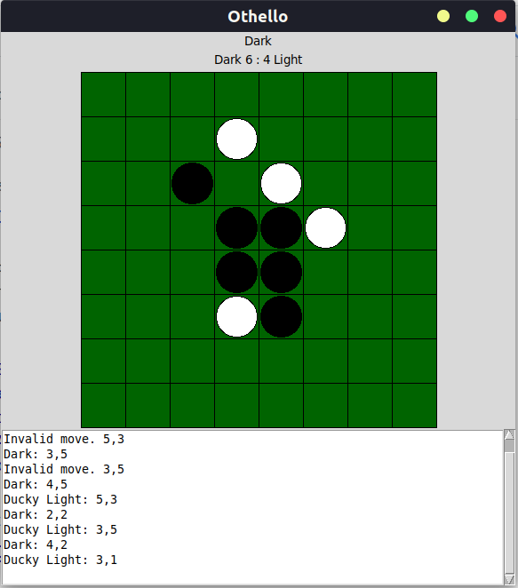

# Othello-AI

### Note: 
- to play with AI with heuristics, replace ```agent.py``` with ```agent_heuristic.py``` in the following commands.
- Run the command in native terminal instead of terminal in IDE(such as VSCode, Pycharm, etc.).
## Commands:
- To play with randy (AI that makes random, but legal, moves)
    - ```$python3 othello_gui.py -d board_size -a randy_ai.py```
- To play with our algo via MINMAX
    - ```$python3 othello_gui.py -d 4 -a agent.py -m```
- To play with ALPHABETA
    - ```$python3 othello_gui.py -d 4 -a agent.py```
- To play two AI against each other
    - ```$python3 othello_gui.py -d 4 -a agent.py -b randy_ai.py```
- To play with ALPHABETA with a depth limit
    - ```$python3 othello gui.py -d 6 -a agent.py -l 5```
- To play with ALPHABETA with a caching State
    - ```$python3 othello gui.py -d 6 -a agent.py -c```
- To play with ALPHABETA with a node selection heuristic
    - ```$python3 othello gui.py -d 6 -a agent.py -o```
